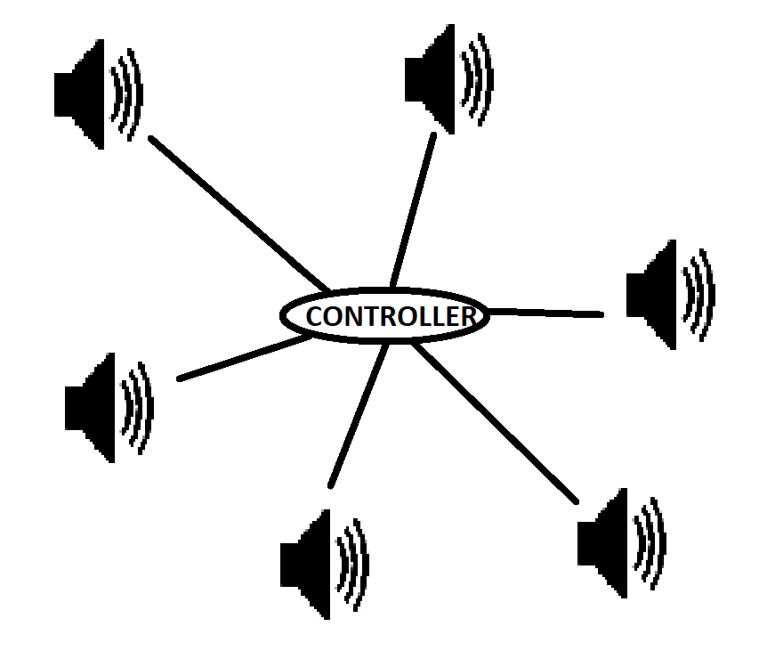

# audio-network

This application allows you to play sounds on lots of pc's at the same time via a webpage.

# How to use
There two important pages: `node.html` and `controller.html`. `node.html` is the page that plays the music and `controller.html` is the page that controls the nodes and sends them audio file URLs to play and when.

# How it works
The application would have been way simpler using websockets but oh well. The controller page tell the backend when it wants music to play. Nodes tell the server that they are online so the controller can see them. Nodes also also find the delay of their system times to the server's system time using a kind of NTP protocol. The nodes then poll the server regularly to see if there is a song to be played and at what time. Then at the right time they all play the same audio at the same time. Much funny.

# Tech stack
raw js frontend, raw php backend w/ sql
